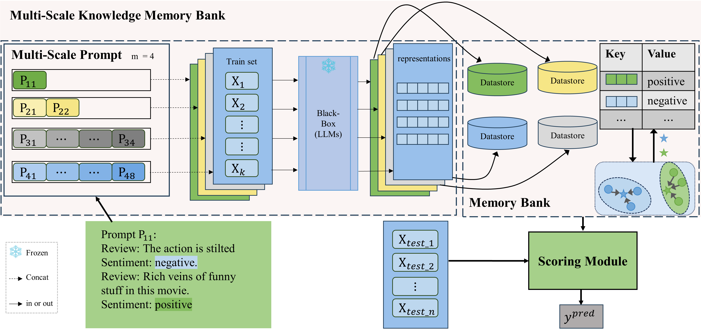

# MuSKPrompt

Released code for our NAACL24 paper: [Multi-Scale Prompt Memory-Augmented Model for Black-Box Scenarios](https://aclanthology.org/2024.naacl-long.98/)


*Overview of MuSKPromt. LLMs are frozen and inaccessible to internal parameters and gradient information. Knowledge is extracted using prompts of four different scales (\(m = 4\)), and stored in various datastores constituting the memory bank. $P_{ic}$ represents the prompt at the i-th scale, where $c$ denotes the number of examples selected from each class. The bottom-left illustrates an example of a prompt with a scale size of 1.*


 In this paper, we present MuSKPrompt (**Mu**lti-**s**cale **K**nowledge **Prompt** for Memory Model), an efficient multi-scale knowledge prompt-based memory model in black-box few-shot text classification task. MuSKPrompt extracts instance-level and class-level knowledge at different scales and stores them in memory banks during training. Then, it references multi-scale memory banks to perform quick inference on new samples via a novel scoring module. MuSKPrompt achieves competitive performance in limited data through multi-scale instance-level and class-level knowledge. Moreover, it realizes gradient-free optimization with zero training parameters in the black-box scenario.


## Preparation
### Requirements
- pytorch == 1.13.1+cu116
- transformers ==  4.20.1
- python == 3.8
### Model and Data
Prepare your LLMs in ./llm/, I personally prefer download them myself and configure the local path in scripts.
Download dataset from [url](https://drive.google.com/file/d/1Yh2blPkJvMtdm5xWKoHr2fLp2i2Bn5Ir/view?usp=share_link) and unzip them in ./data.

### How to Run
After downloading the model and data, and checking the configuration, you can run the following script.
```shell
bash run_muti_scale.sh 
```


## Citation
- If you are interested in our approach, feel free to cite us.
- If you find this repo useful, please cite us as:
```bibtex
@inproceedings{kuang-etal-2024-multi,
    title = "Multi-Scale Prompt Memory-Augmented Model for Black-Box Scenarios",
    author = "Kuang, Xiaojun  and
      Chen, C. L. Philip  and
      Li, Shuzhen  and
      Zhang, Tong",
    booktitle = "Proceedings of the 2024 Conference of the North American Chapter of the Association for Computational Linguistics: Human Language Technologies (Volume 1: Long Papers)",
    month = jun,
    year = "2024",
    publisher = "Association for Computational Linguistics",
    url = "https://aclanthology.org/2024.naacl-long.98",
}
```

## Acknowledge
Our work is based on [KNNPrompting](https://github.com/BenfengXu/KNNPrompting/tree/main?tab=readme-ov-file), with a similar data experiment setup and code architecture to it.  Thanks to the open source code for saving us a lot of time!